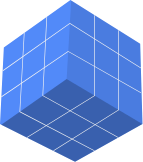
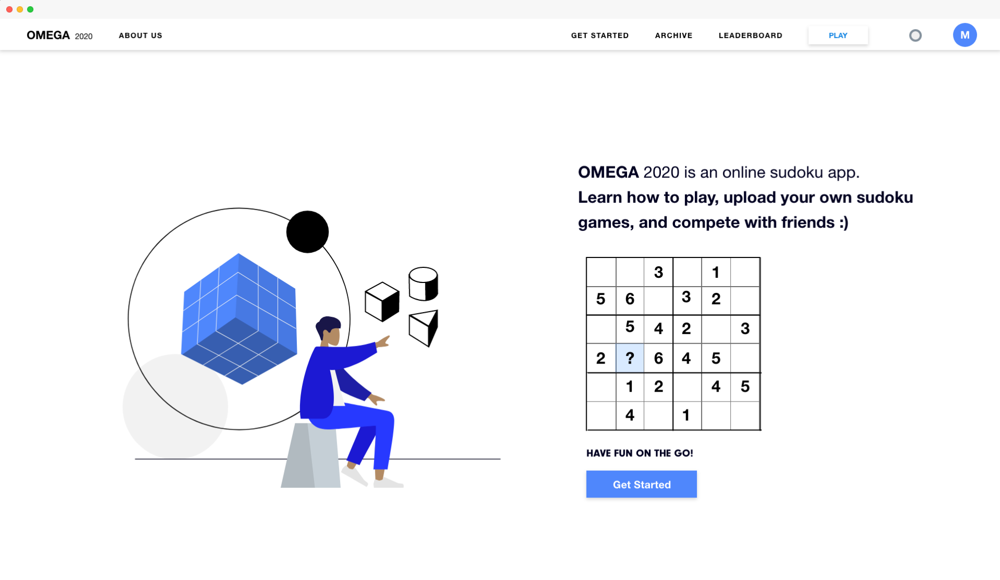

<h1 align="center"></h1>

<h1 align="center">Welcome to Omega 2020</h1>

The online sudoku website.

🛠 This is home to Omega 2020, an online sudoku app geared towards sudoku lovers and people who want to improve their sudoku skills. Learn how to play, upload your own sudoku games, and compete with friends :)

 

---

:desktop_computer: Deployed URL: ------------------  

:iphone: App store and Google play URL: coming soon

---

## :desktop_computer:  [Web Repo](https://github.com/JessicaDosseh/Omega-Web-App.git)  

## :iphone: [Web/iOS/Android Repo Bundle](https://github.com/JessicaDosseh/Omega-Expo.git) 

---

## UX Prototype
:star: Link coming soon 

<h1 align="center"></h1>

---

## INDEX

This repo hosts:
- The [Omega 2020](#) frontend and server code
- A Web development environment

> 📂 For more information, read through our [DOCUMENTATION](https://github.com/JessicaDosseh/Omega-Web-App/tree/master/DOCUMENTATION)
>> [Project Vision Document - (PVD)](https://github.com/JessicaDosseh/Omega-Web-App/blob/master/DOCUMENTATION/0.0.1.DOCS/PVD.md)
> [Usage](#)
>> [Design Specification](#)
> [Trello Board](https://trello.com/b/NyKQYmbB/labs-pt11-omega2020)
>> [Product Canvas](https://www.notion.so/Omega2020-5f51e1cc70a64da5a15e222acabdc463)

- [About Project](#Welcome-to-Omega-2020)
- [Getting Started](#getting-started) 
   - [Project Set Up](#Project-Set-Up)
- [Development Info](#development-info)
- [Contributors](#Contributors)
- [How to Contribute](#How-to-Contribute)

---

# Getting Started

## Project Set Up

- [ ] Create a forked copy of this project.
- [ ] Clone your OWN version of the repository in your terminal. 
- [ ] `git pull` to make sure you are uptodate  
- [ ] `git checkout -b new-branch-name` 
- [ ] Run `yarn` or `npm install`to install node_module.
- [ ] CD into `packages/web`
- [ ] Run `yarn` or `npm install`to install node_module. 
- [ ] Run `yarn start` to start.

:rocket:  DO your magic!

> Git flow cheat sheet

   - [ ] Push your work to your branch: `git add .` | `git commit -m '...'` | `git push origin your-branch-name`

---

# Development Info

---

## Contributors

This project exists thanks to all the people who contribute. [[Contribute](#)].
🚫 Insert screenshot(s) here.

---

## 🤝 Contributing

Shields is a community project. We invite your participation through issues and pull requests! You can peruse the [contributing guidelines](#).

When adding or changing a service [please add tests](#).

This project has quite a backlog of suggestions! If you're new to the project, maybe you'd like to open a pull request to address one of them:
